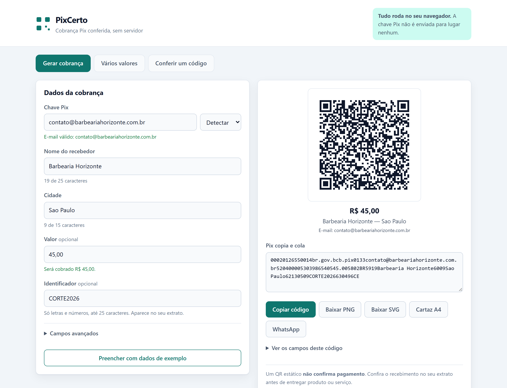
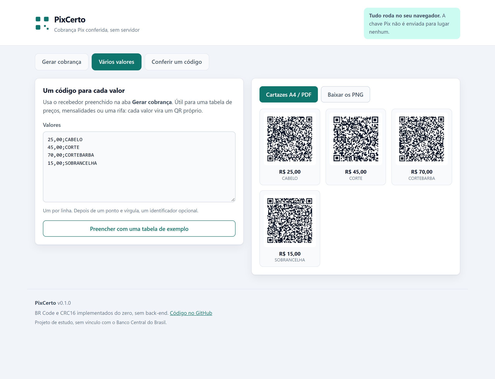
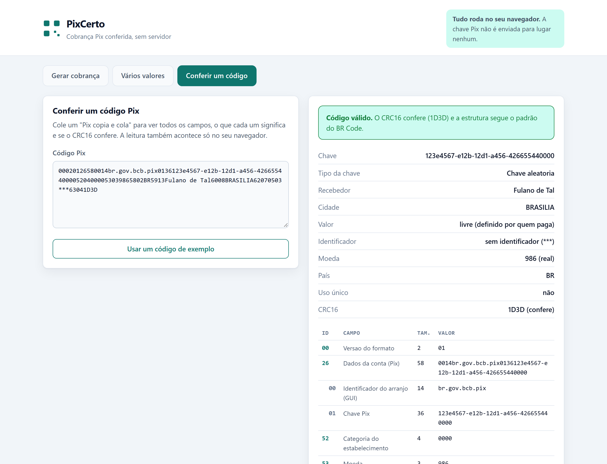
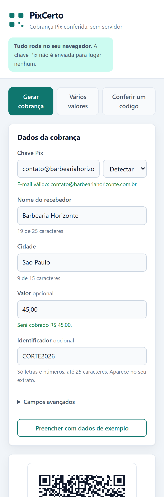
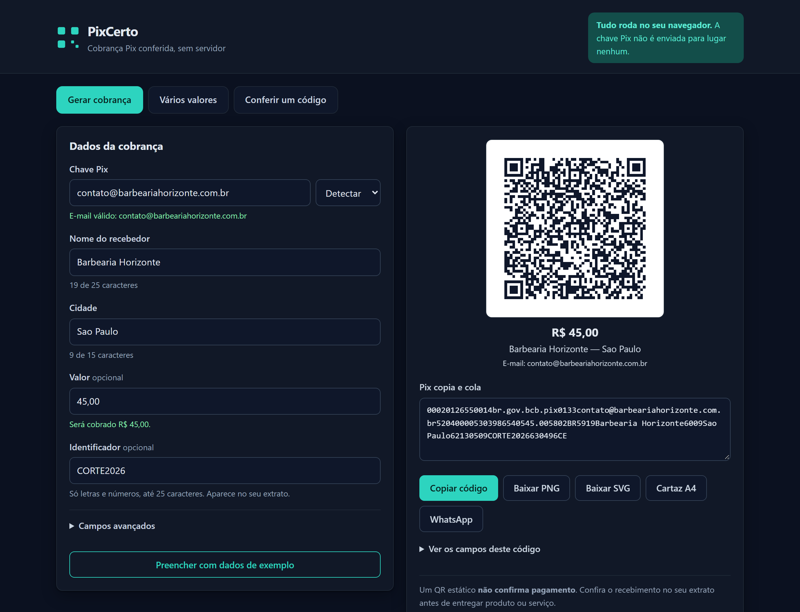

# PixCerto

**[Abrir a demonstracao](https://paulo-carvalho10.github.io/pixcerto/)**

Gerador e conferidor de cobranca Pix que roda inteiramente no navegador.
Implementa o BR Code (padrao EMV MPM, perfil Pix do Banco Central) do zero:
montagem dos campos, CRC16 e leitura de volta.

**A chave Pix nunca sai do dispositivo.** Nao ha back-end, nao ha requisicao de
rede, nao ha telemetria. Todo o calculo acontece em memoria.



## O que ele faz

- Gera o "Pix copia e cola" e o QR Code enquanto voce digita.
- Aceita as cinco formas de chave, com validacao de digito verificador de CPF e
  CNPJ.
- Exporta PNG, SVG e um cartaz A4 pronto para imprimir ou salvar como PDF.
- Gera um codigo para cada valor de uma lista, para tabela de precos ou
  mensalidades.
- Confere um codigo recebido: mostra a arvore de campos, explica cada ID e diz
  se o CRC16 fecha.

## Estado

MVP completo, testado e publicado em
<https://paulo-carvalho10.github.io/pixcerto/>.

| Etapa | Situacao |
|---|---|
| Campos EMV (TLV) | pronto |
| CRC16-CCITT-FALSE | pronto |
| Montagem do payload | pronto |
| Validacao de chave, valor e texto | pronto |
| Decodificador com arvore de campos | pronto |
| Interface responsiva | pronto |
| QR em PNG e SVG | pronto |
| Cartaz A4 e PDF | pronto |
| Geracao em lote | pronto |
| Captura da interface | pronto |
| Deploy | pronto |

131 testes automatizados, typecheck estrito sem erros.

## Telas

**Um código para cada valor**, a partir de uma lista de precos:



**Conferência de um código recebido**, com a árvore de campos e o veredito do
CRC:



No celular e no tema escuro do sistema:

<p>
  
  
</p>

## Como rodar

Requer Node 20 ou superior.

```bash
npm install
npm run dev       # servidor de desenvolvimento
npm test          # suite completa
npm run typecheck
npm run build     # typecheck e build de producao em dist/
npm run preview   # serve o build de producao
```

Para refazer as capturas do README, com o `preview` rodando em outro terminal:

```bash
npx playwright install chromium   # uma vez
npm run capturas
```

O script nao so fotografa: ele abre um Chromium de verdade e confere que o QR
renderiza, que nao ha erro no console, que a pagina nao rola na horizontal em
390px e que apenas um painel fica visivel por aba. Essa ultima checagem existe
porque um defeito real passou pelos testes de DOM: `happy-dom` nao calcula
estilo, entao o teste via o atributo `hidden` no lugar certo enquanto, no
navegador, `.painel { display: grid }` vencia a regra de `[hidden]` e deixava os
tres paineis empilhados na tela.

## Deploy

O fluxo em `.github/workflows/deploy.yml` roda typecheck, testes e build a cada
push, e publica no GitHub Pages a partir da `main`. Um pull request roda a
verificacao mas nao publica.

Para ativar: em **Settings > Pages** do repositorio, escolher **GitHub Actions**
como origem.

Como o `base` do Vite e relativo, o mesmo build funciona tambem no Cloudflare
Pages ou em qualquer hospedagem estatica, sem alterar configuracao.

## O que e o BR Code

A string do "Pix copia e cola" e uma sequencia de campos no formato TLV:

```
ID (2 digitos) + Tamanho (2 digitos) + Valor
```

Por exemplo, `5802BR` e o campo `58` (pais), com `02` caracteres, valendo `BR`.

Campos de um Pix estatico:

| ID | Campo | Conteudo |
|---|---|---|
| `00` | Versao do formato | fixo `01` |
| `01` | Metodo de iniciacao | `12` para uso unico; ausente significa reutilizavel |
| `26` | Dados da conta | template aninhado do Pix |
| `52` | Categoria do estabelecimento | `0000` quando nao informado |
| `53` | Moeda | `986` (real) |
| `54` | Valor | opcional; `123.45`, ponto decimal |
| `58` | Pais | `BR` |
| `59` | Nome do recebedor | ate 25 caracteres |
| `60` | Cidade | ate 15 caracteres |
| `61` | CEP | opcional |
| `62` | Dados adicionais | template aninhado com o txid |
| `63` | CRC16 | sempre o ultimo campo |

Os campos `26` e `62` tem outros campos dentro do valor:

- `26` → `00` GUI `br.gov.bcb.pix`, `01` chave Pix, `02` descricao
- `62` → `05` txid; sem identificador, o padrao manda enviar `***`

## Decisoes tecnicas

**O CRC cobre o proprio cabecalho.** O campo 63 e calculado sobre a string ja
contendo `6304`. E o detalhe que mais derruba implementacao caseira: monta-se o
payload inteiro, concatena-se `6304` e so entao calcula-se o CRC dos 4
hexadecimais que vem em seguida.

**CCITT-FALSE, nao qualquer CRC16.** Polinomio `0x1021`, inicio `0xFFFF`, sem
reflexao, XOR final `0x0000`. Existem variantes de nome parecido que produzem
resultados diferentes. A escolha esta travada por dois vetores independentes:

1. o valor de conferencia do catalogo, `crc16("123456789") == 0x29B1`;
2. o exemplo publicado no manual do BR Code, que o gerador reproduz caractere a
   caractere, CRC `1D3D` incluido.

O segundo e o teste mais valioso do projeto: se a ordem dos campos, alguma
contagem de tamanho ou o CRC estiverem errados, ele quebra.

**Dinheiro em centavos inteiros.** Nenhum valor circula como float. `0.1 + 0.2`
em ponto flutuante nao da `0.3`, e um centavo errado no campo 54 e uma cobranca
errada. A entrada aceita as formas usuais (`10`, `10,50`, `R$ 1.234,56`,
`1,234.56`) e vira um inteiro de centavos na primeira oportunidade.

**Tudo em ASCII, por necessidade do formato.** O tamanho do campo conta bytes.
Um "Joao" com til ocupa dois bytes em UTF-8 e desalinha a leitura de tudo que
vem depois. Acentos sao removidos preservando a letra base, e `field()` recusa
qualquer coisa fora do ASCII imprimivel em vez de gerar um QR silenciosamente
quebrado.

**A chave e a descricao dividem 99 caracteres.** O campo 26 inteiro cabe em 99
caracteres, e o GUI ja consome 18. Uma chave de e-mail no limite de 77 nao
deixa espaco nenhum para a descricao. O gerador calcula esse orcamento, corta a
descricao no que couber e avisa quando o faz, em vez de emitir um campo maior
que o formato permite.

**O decodificador existe para provar o gerador.** Se
`decodePix(buildPixPayload(x))` nao devolve `x`, uma das duas metades esta
errada. Esse teste de ida e volta cobre nove combinacoes de entrada e nao
depende de nenhum aplicativo de banco para rodar. A arvore de campos mostrada na
tela tambem vem dele, e nao de um segundo caminho de montagem: o que aparece e o
resultado de ler de volta o proprio codigo gerado.

**Interface sem framework.** Sao dois formularios e um painel de resultado.
TypeScript e DOM direto resolvem isso em menos codigo do que a configuracao de
uma biblioteca de componentes, e o bundle fica em 20 kB comprimidos com a
biblioteca de QR incluida. Um teste de fiacao com happy-dom carrega o
`index.html` de verdade e digita nos campos, para pegar o que o typecheck nao ve:
seletor renomeado, atributo errado, evento que parou de disparar.

**PNG desenhado em canvas, nao convertido do SVG.** Converter passaria por
carregar uma imagem e esbarraria em diferencas de suavizacao entre navegadores.
Desenhar retangulo a retangulo, com escala inteira, garante modulo de borda
exata, que e o que um leitor de QR precisa.

**PDF pela impressao do navegador.** O cartaz A4 abre em janela propria com a
sua propria folha de estilo, e o dialogo de impressao de qualquer navegador atual
oferece "Salvar como PDF". Uma biblioteca de geracao de PDF acrescentaria algumas
centenas de kilobytes para produzir o mesmo arquivo.

## Avisos

- Um QR estatico **nao confirma pagamento**. Conferir o recebimento no extrato e
  responsabilidade de quem cobra.
- O botao de WhatsApp abre o compartilhamento **sem numero de destino**: quem
  escolhe o contato e a pessoa, e nada e enviado automaticamente.
- A validacao e de formato e de digito verificador. Uma chave bem formada pode
  simplesmente nao existir; isso so o DICT responde, e este projeto nao consulta
  servico nenhum.
- Os CPFs e CNPJs usados nos testes sao ficticios. Tem digito verificador valido
  de proposito, para exercitar a validacao, e nao pertencem a ninguem.

## Licenca

MIT.
